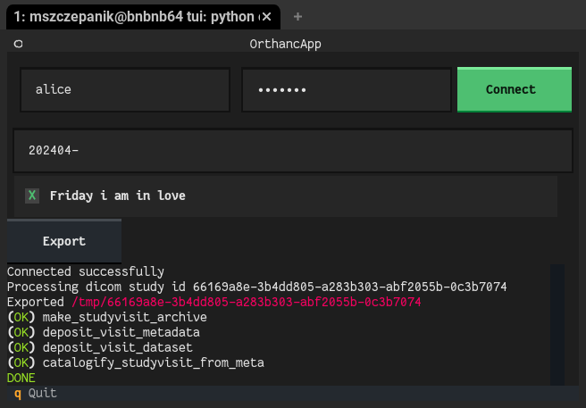

# ICF/CCF Orthanc text-based user interface

This app provides a text-based user interface (TUI), based on [Textual](https://textual.textualize.io/), for interacting with [Orthanc](https://orthanc.uclouvain.be/) and CCF/[ICF Utils](https://inm-icf-utilities.readthedocs.io/).
It can be used to query Orthanc for studies from a given date (range), export them, and run the ICF archival workflow.

## Configuration

Some values are not provided through the UI, but are read from a configuration file.
Edit the values in `config.toml.example` and place the file in your user / site config directory as `orthanc_textual/config.toml`.
The directories are determined with platformdirs, and will be printed if you run the app without the configuration in place.
For example, on Debian, the config file can be in `~/.config/orthanc_textual/config.toml` (user) or `/etc/xdg/orthanc_textual/config.toml` (site).
User config has precedence over site config.

Values to define:
- `orthanc_base_url` - the URL of the Orthanc instance (used to perform API queries)
- `icf_image` - path to the Singularity image with the ICF utils (used to execute the ICF scripts)
- `store_base_dir` - the base directory of the ICF dicom store (used to put outputs of the ICF workflow)

## Usage

1. Enter the Orthanc Username and Password and click connect. They will be tested, and if they are OK, the button will turn green.
2. Enter the Study Date in the format `yyyymmdd` and hit Enter. The date can can also be an open or closed range in a format accepted by the Orthanc API. Examples: `20240801`, `20240801-20240812`, `20240801-`, `202408-`
3. After hitting Enter, the matching DICOM studies will be shown (using the DICOM PatientID field) in the selection list.
4. Select the ones you want to process and click Export. Wait for the process to finish. Information will be printed in the log window below.
5. To quit the app, hit q or click the circle in the upper-left and select "Quit the application".

## Implementation notes

The study and visit IDs (as defined by the ICF utils) will be derived from the DICOM PatientID field by splitting at the first underscore (`<study ID>_<visit ID>`).
If the PatientID field has no underscore, the study ID will be set to `undefined` and the entire PatientID will be used as the visit ID.
In principle, any of the main DICOM tags stored in Orthanc's database (these typically include StudyDescription, PatientID, PatientName, and more) could be used for the purpose; currently only the PatientID is used.

## Acknowledgements

This app was developed with funding from the Deutsche Forschungsgemeinschaft (DFG, German Research Foundation) under grant SFB 1451 ([431549029](https://gepris.dfg.de/gepris/projekt/431549029), INF project).
